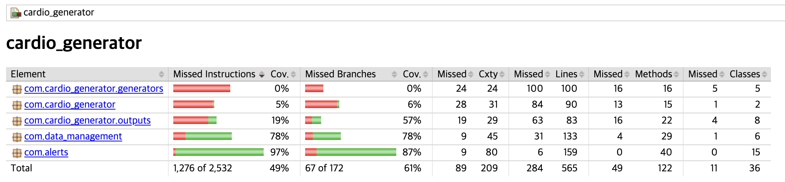

# Code Coverage Report — Part 3

## Summary

Overall coverage is 18% instructions and 26% branches. The coverage breakdown by package reflects the scope of testing for this part of the project.

**com.data_management — 81% instruction coverage, 76% branch coverage**
This is the package targeted by our tests. `DataStorage`, `Patient`, `PatientRecord`, and `FileDataReader` are all covered. The remaining uncovered portion is the `DataStorage.main()` method, which is a demonstration entry point and was not tested since it requires a fully wired `DataReader` implementation at runtime.

**com.cardio_generator, com.cardio_generator.generators, com.cardio_generator.outputs — 0%**
These packages contain the simulator classes provided as part of the project (e.g. `HealthDataSimulator`, `BloodPressureDataGenerator`, `FileOutputStrategy`). Testing these was not required for Part 3 — they were part of the given codebase and their behaviour is verified by running the simulator directly.

**com.alerts — 0%**
The `AlertGenerator` and `Alert` classes contain only stub implementations at this stage (`evaluateData` is empty). Tests for alert logic are being implemented as part of a separate workstream and will be included in a future commit.
