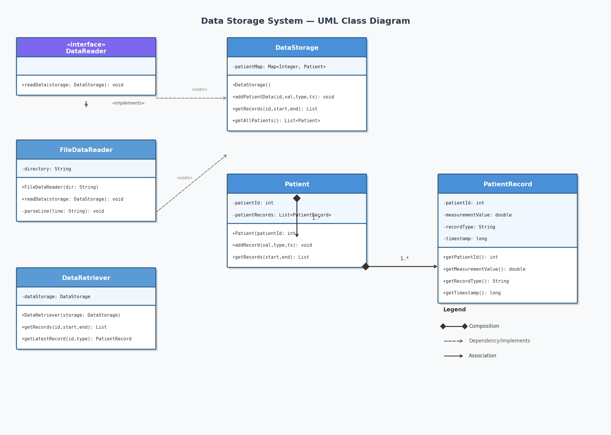
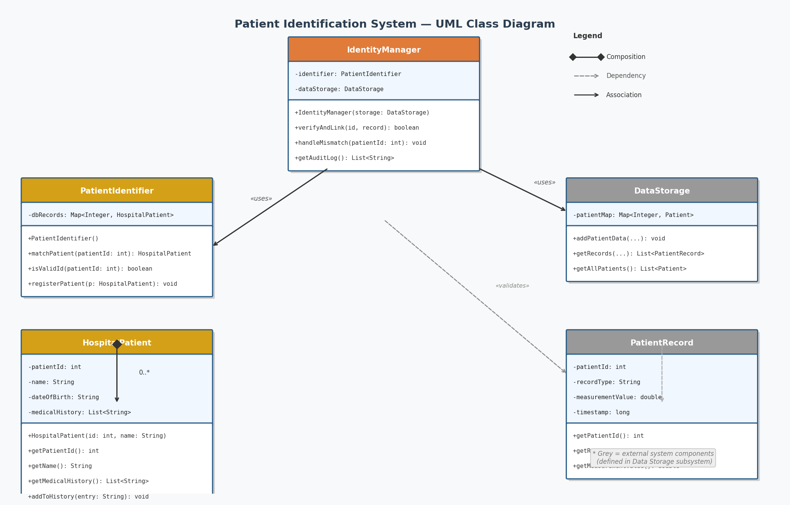

# UML Class Diagrams

## 1. Data Storage System

### Design Rationale

The Data Storage System is designed around a clear separation between data ingestion, storage, and retrieval. At its core, `DataStorage` acts as the single entry point for all patient data management. It maintains a `Map<Integer, Patient>` that indexes all patients by their unique ID, enabling O(1) lookups when new measurements arrive or records are queried.

The `Patient` class serves as an aggregate root, owning a list of `PatientRecord` objects. Each `PatientRecord` is an immutable value object that captures a single measurement — its type (e.g., "BloodPressure"), numeric value, and timestamp. This composition hierarchy (DataStorage → Patient → PatientRecord) reflects the natural ownership chain: the storage owns patients, and patients own their records.

The `DataReader` interface decouples the storage layer from the source of incoming data. Any class that can produce patient records — whether reading from a file, a TCP stream, or a WebSocket — simply implements `readData(DataStorage)`. The `FileDataReader` is a concrete implementation that parses the simulator's file output and populates `DataStorage` accordingly. This design follows the Dependency Inversion Principle, keeping the storage logic independent of how data arrives.

The `DataRetriever` class provides a clean query API for medical staff, offering time-range queries and latest-record lookups without exposing the internal map structure. This separation of write responsibility (DataReader) from read responsibility (DataRetriever) supports the Single Responsibility Principle and makes the system easier to extend — for example, adding caching or access control to retrieval without touching storage logic.

---

## 2. Patient Identification System

### Design Rationale

The Patient Identification System ensures that every incoming data point is correctly linked to a verified hospital patient. The central orchestrator is `IdentityManager`, which coordinates between the identification logic and the data storage layer. It exposes a `verifyAndLink()` method that validates a patient record against the hospital database before it is accepted into storage, and a `handleMismatch()` method for cases where no matching patient is found.

`PatientIdentifier` encapsulates the matching logic, maintaining a map of known `HospitalPatient` records indexed by patient ID. Its `matchPatient()` method returns the corresponding hospital record, while `isValidId()` provides a lightweight pre-check. This separation means the identity matching strategy can be swapped or mocked in tests without affecting `IdentityManager`.

`HospitalPatient` represents a patient's real hospital record — including name, date of birth, and medical history. It is kept separate from the simulator's `Patient` class deliberately: the hospital record is a source-of-truth entity from an external system, while `Patient` in the data management package is a runtime container for incoming measurements.

`DataStorage` and `PatientRecord` are shown as external components (in grey) to make clear that the identification system depends on them but does not own them. This boundary enforces separation of concerns: the identification system validates and routes data, while the storage system manages persistence. Together they ensure data integrity — only verified, matched records are ever written to storage, reducing the risk of orphaned or misattributed patient data.
